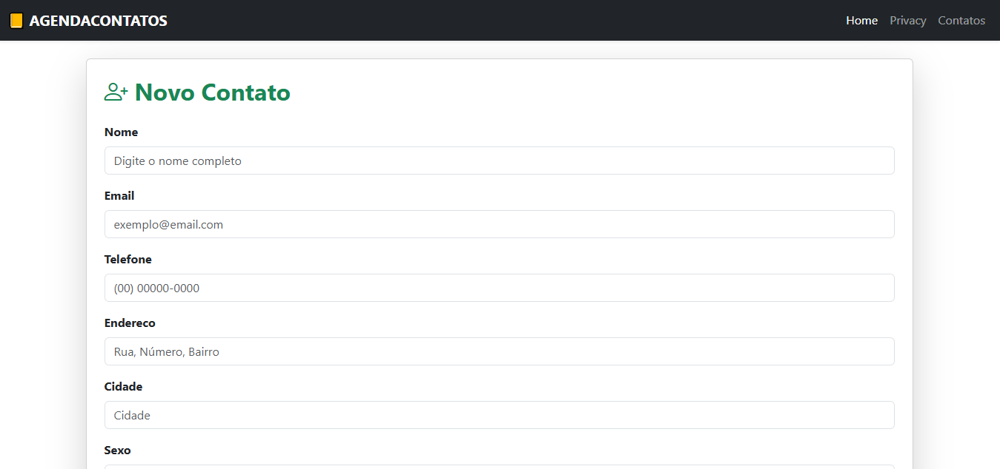
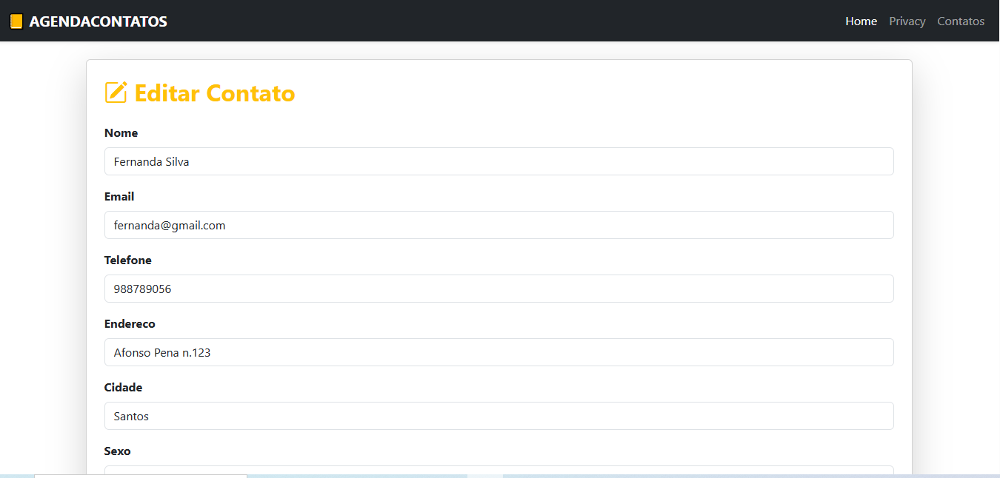
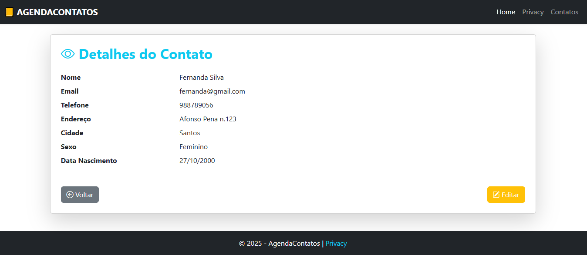
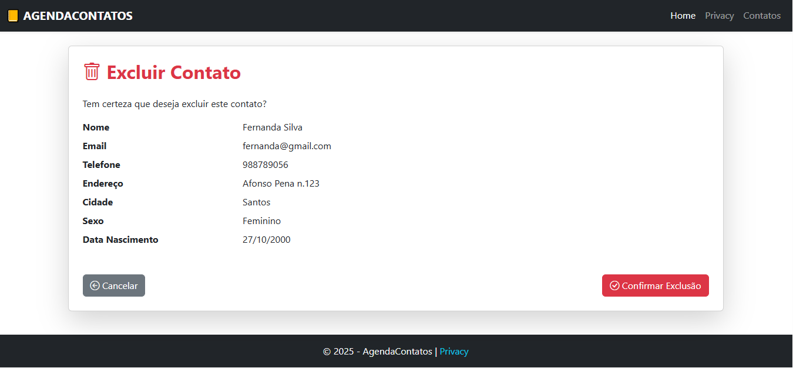

# 📒 Agenda de Contatos

Aplicação ASP.NET Core MVC para gerenciamento de contatos.  
Permite **cadastrar, editar, visualizar, excluir e listar contatos** de forma simples e organizada.

---

## 🚀 Tecnologias utilizadas
- **C# .NET 8**
- **ASP.NET Core MVC**
- **Entity Framework Core**
- **SQL Server**
- **Bootstrap 5**
- **Razor Pages**

---

## ⚙️ Funcionalidades
- Cadastro de contatos com os seguintes campos:
  - Nome
  - E-mail
  - Telefone
  - Endereço
  - Sexo
  - Cidade
  - Data de Nascimento
- Edição e exclusão de contatos existentes
- Listagem de todos os contatos cadastrados
- Visualização detalhada de cada contato
- Validação de dados no formulário
- Interface responsiva com Bootstrap

---

## 🖼️ Layout
Exemplo de telas do sistema:  

### Página inicial (Index)


### Cadastro de contato (Create)


### Edição de contato (Edit)


### Detalhes do contato (Details)


### Exclusão de contato (Delete)


> 💡 Dica: certifique-se que as imagens estão na pasta `prints/` na raiz do projeto.

---

## 📦 Como executar o projeto
1. Clone este repositório:
   ```bash
   git clone https://github.com/cremutcho/AgendaContatos.git
